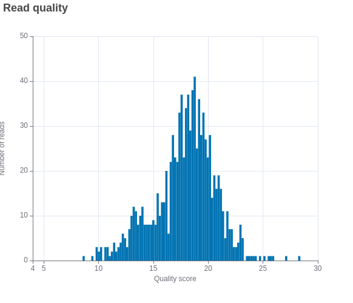

# ONT-data-analysis


Information focused on the analysis of data from Oxford nanopore technologies using EPI2ME workflows and in-house scripts.


## Requirements: 
* Nextflow
* Singularity
* Docker

## Basecaller

Readings from oxford nanopore technologies are delivered to the user in pod5 and fast5 format.

<p style="text-align: center;">
    
</p>

Data can be analyzed via GUI by downloading [EPI2ME labs](https://labs.epi2me.io/downloads/) or via command line using nextflow modules from [GitHub](https://github.com/epi2me-labs). It is advisable to transform this data to other aligned formats such as BAM, SAM and CRAM or non-aligned such as __fastq__ for which it is possible to use the wf-basecalling workflow. This module can be executed as follows: 
```bash
nextflow run epi2me-labs/wf-basecalling \
  -profile singularity \
  --input /home/jpramosg/Desktop/genomic_analysis/wf-basecalling/input/ \
  --ref /home/jpramosg/Desktop/genomic_analysis/wf-basecalling/file.fasta \
  --dorado_ext pod5 \
  --out_dir output \
  --basecaller_cfg dna_r10.4.1_e8.2_400bps_hac@v4.1.0 \
  --remora_cfg "dna_r10.4.1_e8.2_400bps_hac@v4.1.0_5mCG_5hmCG@v2"
  ```

__Note__ : In case of more information about the configuration of the execution access the [wf-basecalling](https://github.com/epi2me-labs/wf-basecalling) workflow. Therefore, in case you do not meet certain specifications it is necessary to create a configuration file (e.g: __nextflow.config__): 

Results 



## Transcriptome analysis in Musaceae

Once the fastq format is obtained it is necessary to perform a mapping and counting of transcripts and genes using the wf-transcriptomics workflow or it can be done by developing your own pipelines (in-house bash, python and R scritps), check [meta-analysis_musaceas](https://github.com/jpramosg/meta-analysis_musaceas) repository. The reference genome from the [ensembl plants](https://plants.ensembl.org/Musa_acuminata/Info/Index) database was used for read mapping. In addition, the genomic annotation file in gff3 format was downloaded from the same platform and subsequently converted to gff format using the gffread program. The command used to assemble genes and identify differentially expressed genes (DEGs) was as follows: 

```bash
nextflow run epi2me-labs/wf-transcriptomes \
   --de_analysis     
   --direct_rna     
   --fastq 'fastq/' \
   --ref_annotation 'reference_musa.gff' \
   --ref_genome 'Musa_acuminata.Musa_acuminata_v2.dna.toplevel.fa'  \
   --sample_sheet 'transcriptome_musa.csv' \
   -profile standard
  ```
In case of DEGs identification it is necessary to create a .csv file similar to the following one, where the biological replicates and treatment and control readings are indicated. 

eg. transcriptome_musa.csv
```
barcode,sample_id,alias,condition
barcode01,sample01,sample01,control
barcode02,sample02,sample02,control
barcode03,sample03,sample03,threated
barcode04,sample04,sample04,threated

```
__Note__: Currently there is a version problem with nextflow in this workflow, therefore, it is recommended to run on older versions by ```export NXF_VER=23.10.1```.

## Results of DEGs 

After successfully running the pipeline, a series of results will be displayed where you can identify and observe those genes that are overexpressed. 

 

All the summary results obtained are detailed in the file __wf-transcriptomes-report.html__. 